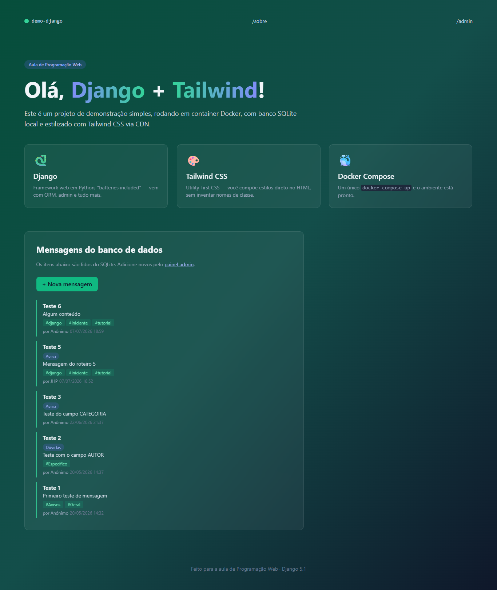
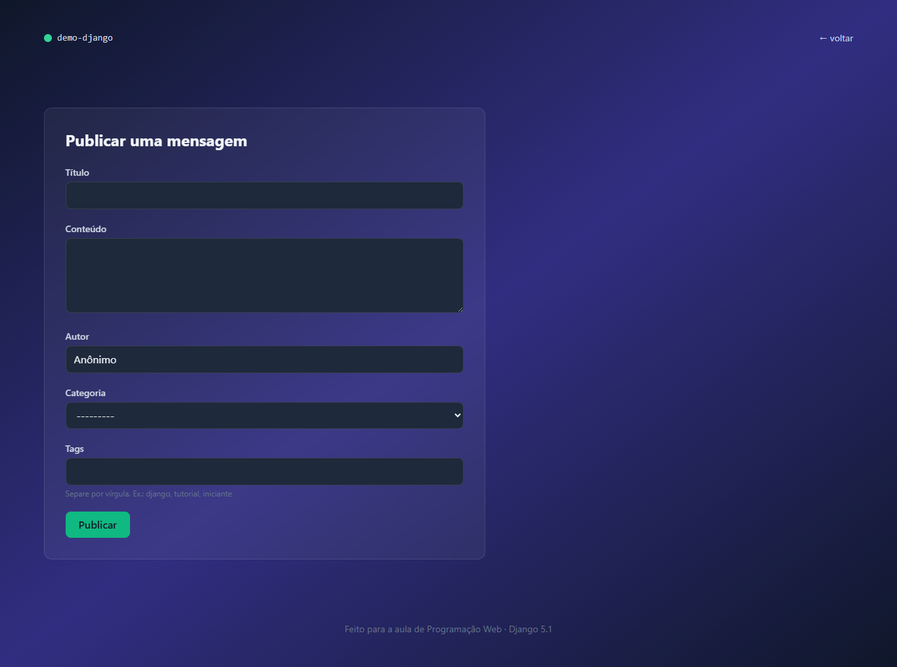
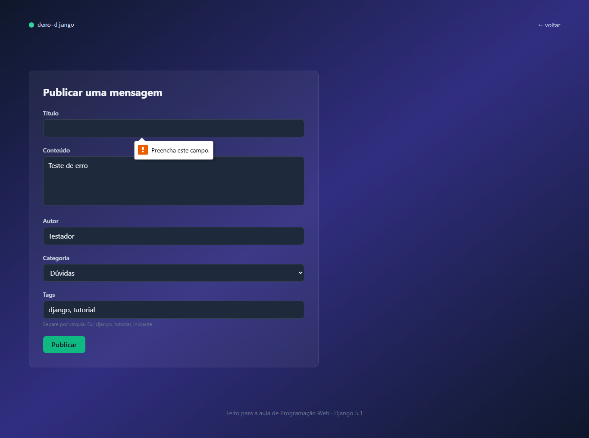

# 🐍 Demo Django — Parte 5: Formulário e Ciclo CRUD

> **Disciplina:** Programação Web  
> **Aluno:** [João Henrique Pedrosa de Souza]  
> **Branch:** [`bcc481-django-parte5`](https://github.com/SEU_USUARIO/demo-django/tree/bcc481-django-parte5)

---

## 📋 Descrição

Continuação do projeto `demo-django`, construída como parte do **Roteiro 5** da disciplina de Programação Web. A partir do projeto da Parte 4, esta etapa abre o **Create** do ciclo CRUD para visitantes comuns, sem depender do painel admin:

- Criação de `home/forms.py` com `ModelForm` para cadastro de mensagens
- View `nova_mensagem` que responde a **GET** (exibe formulário) e **POST** (valida e salva)
- Processamento do campo de tags em texto livre com `slugify` e `get_or_create`
- Proteção contra CSRF com ``
- Padrão **Post/Redirect/Get (PRG)** para evitar reenvio duplo do formulário
- Template `nova.html` com renderização automática dos campos e exibição de erros
- Flash messages com o sistema `django.contrib.messages` (feedback visual pós-envio)

---

## 📸 Sistema em execução

### Página principal com botão "+ Nova mensagem"

> Botão verde adicionado ao `index.html` para acessar o formulário público.

<!-- Substitua pela sua captura de tela -->

### Formulário de cadastro em `/nova/`

> Formulário com campos de título, conteúdo, autor, categoria e tags (texto livre).

<!-- Substitua pela sua captura de tela -->

### Validação de campos obrigatórios

> Ao tentar publicar com o título em branco, o formulário recarrega com a mensagem de erro em vermelho, sem salvar nada no banco.

<!-- Substitua pela sua captura de tela -->

---

## 📚 Conceitos abordados neste roteiro

- Ciclo **CRUD** e quais operações foram implementadas até aqui
- Diferença entre métodos HTTP **GET** e **POST**
- **`ModelForm`**: geração automática de formulários a partir de models
- **`Meta.fields`**, **`widgets`** e **`labels`** para customização do formulário
- Campo extra fora do `Meta` para processar `ManyToManyField` em texto livre
- **`form.is_valid()`** e **`form.cleaned_data`** para validação e acesso aos dados
- **`slugify()`** para converter texto livre em slug válido para `SlugField`
- **`get_or_create()`** para criação idempotente de tags
- **``** e proteção contra CSRF
- Padrão **Post/Redirect/Get (PRG)** para evitar reenvio duplo
- Sistema de **flash messages** com `django.contrib.messages`
- Renderização automática de campos com ``
