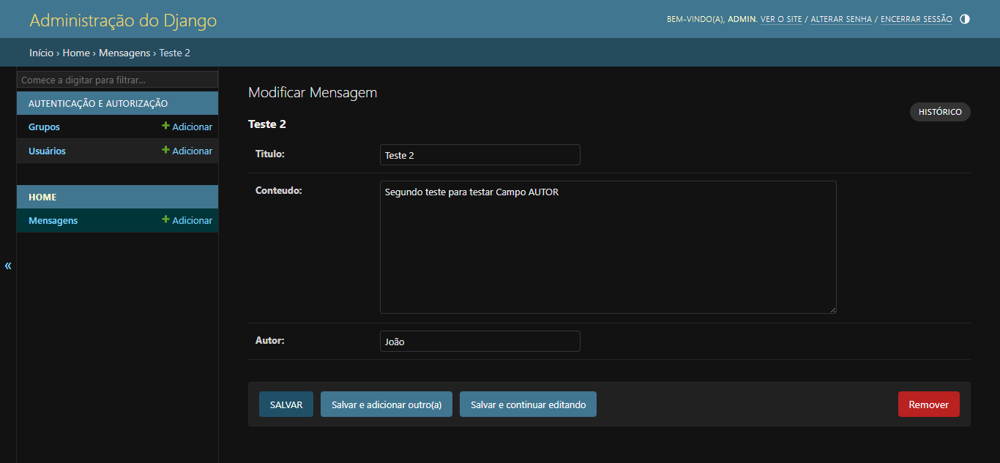
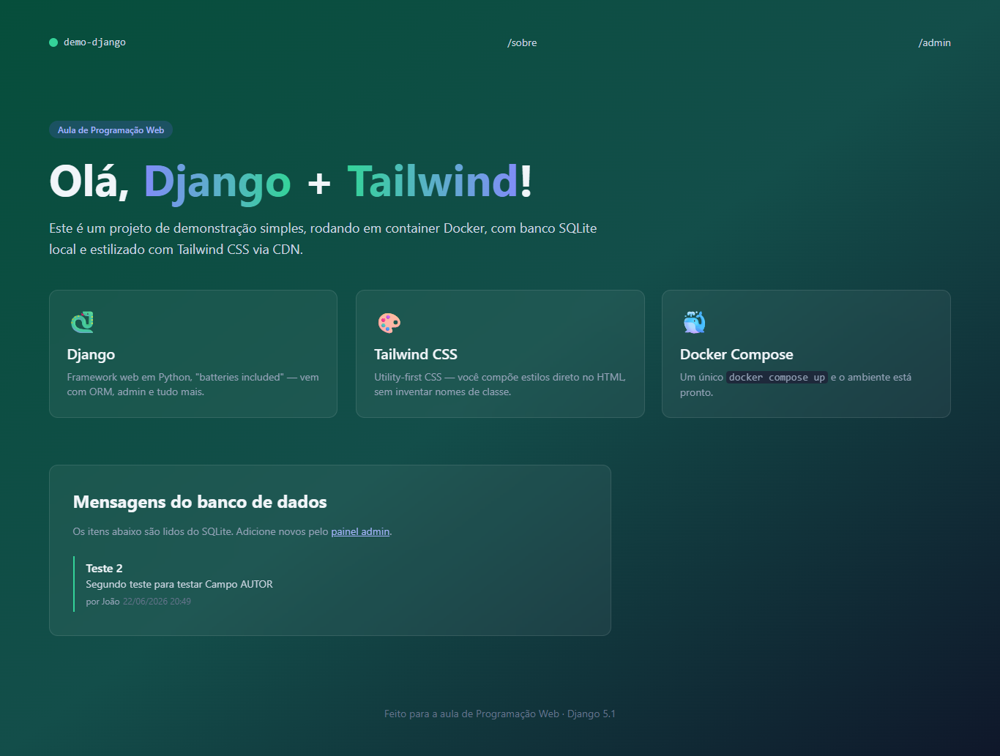
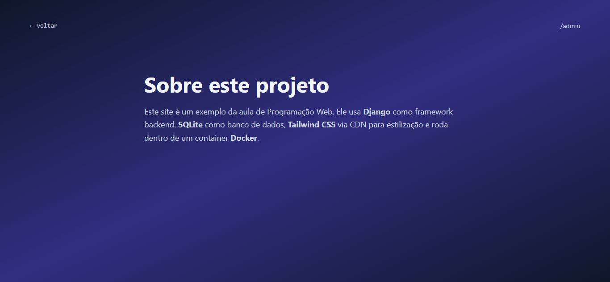

# 🐍 Demo Django — Parte 2: Modelos, Rotas e Admin

> **Disciplina:** Programação Web  
> **Aluno:** [João Henrique Pedrosa de Souza]  
> **Branch:** [`bcc481-django-parte2`](https://github.com/JoaoHPS06/demo-django/tree/bcc481-django-parte2)

---

## 📋 Descrição

Continuação do projeto `demo-django`, construída como parte do **Roteiro 2** da disciplina de Programação Web. A partir do projeto base do Roteiro 1, esta etapa evolui o sistema com:

- Criação do usuário administrador e cadastro de mensagens pelo painel Django Admin
- Adição do campo `autor` ao modelo `Mensagem`, com geração de nova migration
- Criação de uma segunda página `/sobre/` (nova rota + nova view + novo template)
- Customização visual via classes Tailwind
- Compreensão do fluxo **MTV** (Model–Template–View) do Django

---

## ⚙️ Como executar

### Passo a passo

**1. Clone o repositório e acesse o branch correto:**

```bash
git clone https://github.com/JoaoHPS06/demo-django.git
cd demo-django
git checkout bcc481-django-parte2
```

**2. Suba o container:**

```bash
docker compose up --build
```

**3. Em um segundo terminal, crie o superusuário:**

```bash
docker compose exec web python manage.py createsuperuser
```

Informe nome de usuário, e-mail (opcional) e senha.

**4. Acesse no navegador:**

| URL | Descrição |
|---|---|
| http://localhost:8000 | Página principal com lista de mensagens |
| http://localhost:8000/sobre/ | Nova página estática "Sobre" |
| http://localhost:8000/admin/ | Painel administrativo Django |

**5. Para parar o servidor:**

```bash
# Ctrl+C no terminal, depois:
docker compose down
```

---

## 📸 Sistema em execução

### Cadastro de mensagem no painel Admin

> Após criar o superusuário e acessar `/admin/`, é possível cadastrar mensagens com título, conteúdo e autor.



### Página principal com mensagens e campo autor

> As mensagens cadastradas aparecem na página inicial, agora exibindo também o campo `autor` abaixo do conteúdo.

<!-- Substitua pela sua captura de tela -->


### Página /sobre/

> Nova rota estática criada neste roteiro, acessível pelo link `/sobre` no menu de navegação.

<!-- Substitua pela sua captura de tela -->


---

## 📚 Conceitos abordados neste roteiro

- Criação de superusuário com `createsuperuser` e uso do Django Admin
- Evolução de modelos: adição de campos e uso de `default`
- Geração e aplicação de migrations incrementais (`makemigrations` / `migrate`)
- Criação de novas rotas e views (FBV — Function-Based View)
- Templates estáticos (sem dados do banco)
- Navegação entre páginas com links HTML e ``
- Fluxo MTV completo: Model → View → Template
