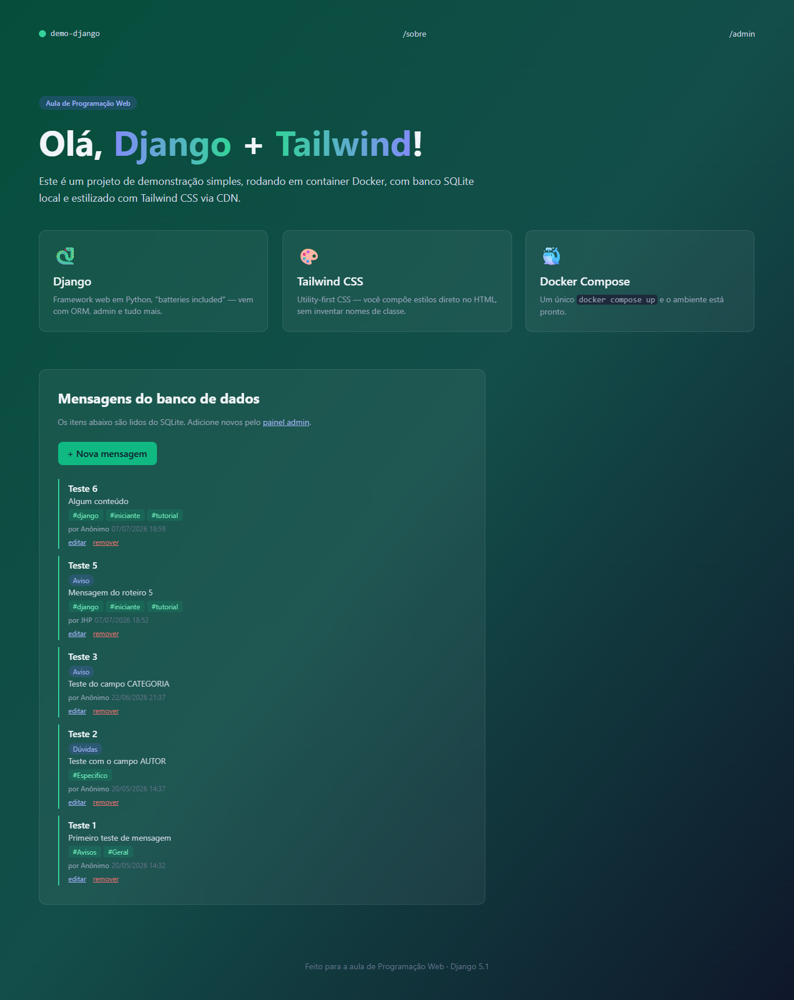
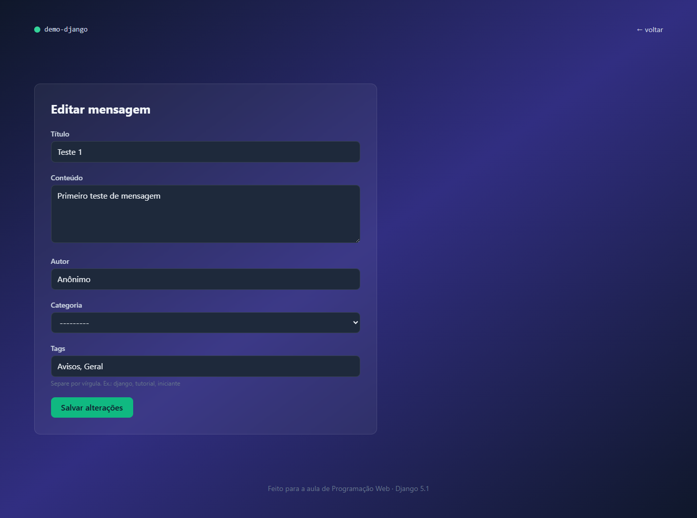
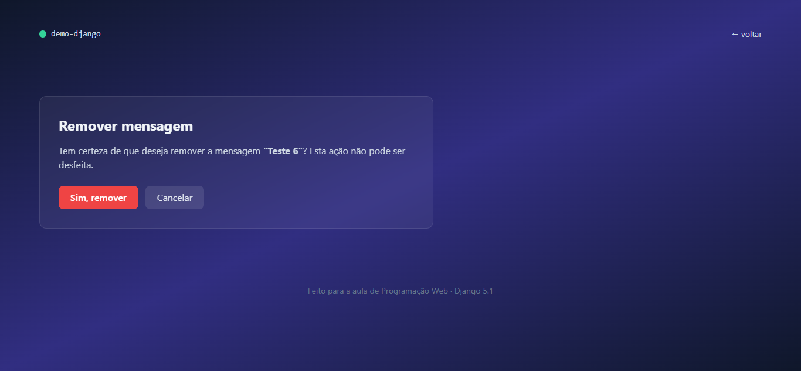
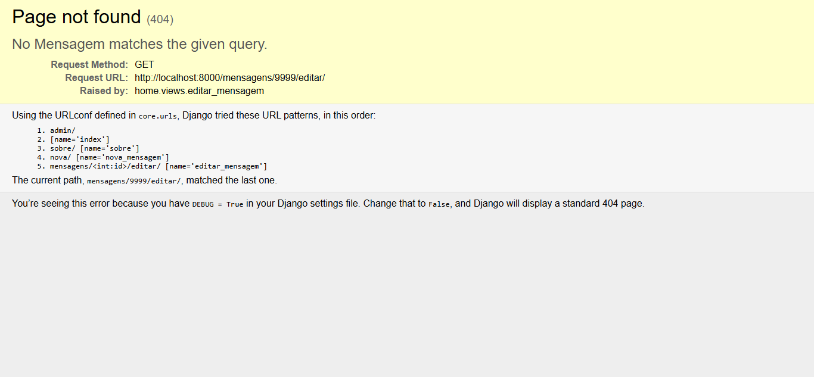

# 🐍 Demo Django — Parte 6: CRUD Completo (Update e Delete)

> **Disciplina:** Programação Web  
> **Aluno:** [João Henrique Pedrosa de Souza]  
> **Branch:** [`bcc481-django-parte6`](https://github.com/SEU_USUARIO/demo-django/tree/bcc481-django-parte6)

---

## 📋 Descrição

Continuação do projeto `demo-django`, construída como parte do **Roteiro 6** da disciplina de Programação Web. A partir do projeto da Parte 5, esta etapa finaliza o ciclo CRUD implementando **edição** e **remoção** de mensagens pela interface pública:

- Parâmetros de rota com `<int:id>` para identificar o registro na URL
- `get_object_or_404` para buscar mensagens com segurança (retorna 404 em vez de erro)
- Reaproveitamento do `MensagemForm` com `instance` para pré-preencher e atualizar
- Função auxiliar `_aplicar_tags()` seguindo o princípio **DRY**
- `mensagem.tags.clear()` antes de reaplicar tags na edição
- Página de confirmação antes de apagar (padrão "delete via POST")
- Botões "editar" e "remover" em cada item da lista na página principal

---

## 📸 Sistema em execução

### Página principal com botões "editar" e "remover"

> Cada mensagem agora exibe dois links de ação no rodapé do card.

<!-- Substitua pela sua captura de tela -->

### Formulário de edição pré-preenchido

> O formulário em `/mensagens/<id>/editar/` abre já preenchido com os dados atuais, inclusive as tags separadas por vírgula no campo de texto.

<!-- Substitua pela sua captura de tela -->

### Página de confirmação de remoção

> Antes de apagar, o visitante vê o título da mensagem e os botões "Sim, remover" (vermelho, POST) e "Cancelar" (link neutro).

<!-- Substitua pela sua captura de tela -->

### Página 404 ao acessar id inexistente

> Ao tentar editar ou remover um id que não existe (ex.: `/mensagens/9999/editar/`), o Django exibe a página 404 em vez de um erro — efeito do `get_object_or_404`.

<!-- Substitua pela sua captura de tela -->

---

## 📚 Conceitos abordados neste roteiro

- **Parâmetros de rota** com `<int:id>` no `urls.py`
- **`get_object_or_404`** para busca segura com resposta 404 automática
- **`ModelForm` com `instance`** para pré-preencher e atualizar um registro existente
- **`initial`** no `ModelForm` para preencher campos extras fora do `Meta.fields`
- **`mensagem.tags.clear()`** para substituição completa em relações N:N
- Princípio **DRY** (*Don't Repeat Yourself*) com função auxiliar privada
- **Exclusão via POST** e por que nunca via GET
- Página de **confirmação antes de apagar** (padrão de UX e segurança)
- **`mensagem.delete()`** e comportamento em cascata nas tabelas de junção
- **``** para gerar URLs parametrizadas no template
- Ciclo **CRUD completo** sem uso do painel admin
