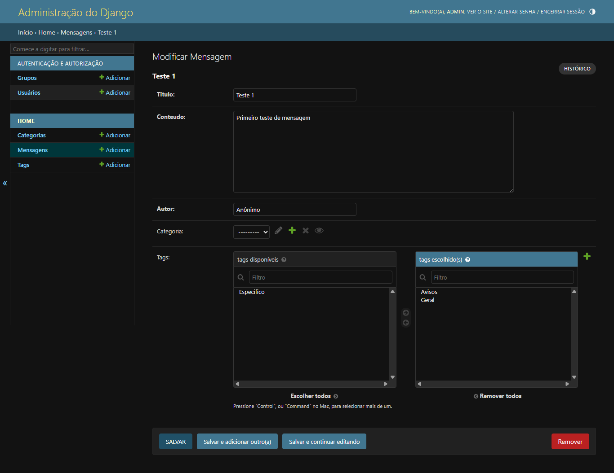
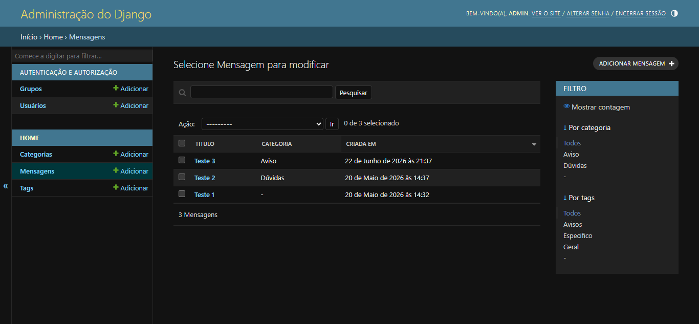

# 🐍 Demo Django — Parte 4: Relacionamento Muitos-para-Muitos

> **Disciplina:** Programação Web  
> **Aluno:** [João Henrique Pedrosa de Souza]  
> **Branch:** [`bcc481-django-parte4`](https://github.com/SEU_USUARIO/demo-django/tree/bcc481-django-parte4)

---

## 📋 Descrição

Continuação do projeto `demo-django`, construída como parte do **Roteiro 4** da disciplina de Programação Web. A partir do projeto da Parte 3, esta etapa introduz o relacionamento **muitos-para-muitos** (N:N) com o model `Tag`:

- Criação do model `Tag` com `SlugField` e vínculo `ManyToManyField` em `Mensagem`
- Entendimento da tabela de junção gerada automaticamente pelo Django (`home_mensagem_tags`)
- Registro de `Tag` no Admin com `filter_horizontal` para seleção visual confortável
- Exibição das tags no template com ``
- Inserção de dados via shell interativo do Django (ORM sem passar pelo admin)

---

## 📸 Sistema em execução

### Admin — seleção de tags com `filter_horizontal`

> O widget `filter_horizontal` substitui o `<select multiple>` padrão por dois painéis lado a lado — "Disponíveis" e "Escolhidas" — muito mais confortáveis de usar.

<!-- Substitua pela sua captura de tela -->

### Admin — listagem de mensagens com filtro por tags

> O painel exibe o filtro lateral com as tags cadastradas, além do filtro por categoria já existente da Parte 3.

<!-- Substitua pela sua captura de tela -->

### Página principal com hashtags

> Cada mensagem exibe as tags associadas em formato de hashtag (`#aviso`, `#específico`, `#geral`). Mensagens sem tags não exibem o bloco (proteção via ``).

<!-- Substitua pela sua captura de tela -->

---

## 📚 Conceitos abordados neste roteiro

- Diferença entre `ForeignKey` (1:N) e `ManyToManyField` (N:N)
- `SlugField` e sua utilidade para chaves textuais em URLs
- Tabela de junção gerada automaticamente pelo Django ORM
- `blank=True` em `ManyToManyField` (e por que não se usa `null=True`)
- `filter_horizontal` no Django Admin para campos N:N
- Iteração sobre `ManyToManyField` no template com ``
- `get_or_create` para inserção idempotente de dados
- Acesso inverso via `related_name` nos dois sentidos da relação N:N
- Inspeção de schema com `dbshell` e comandos SQLite
