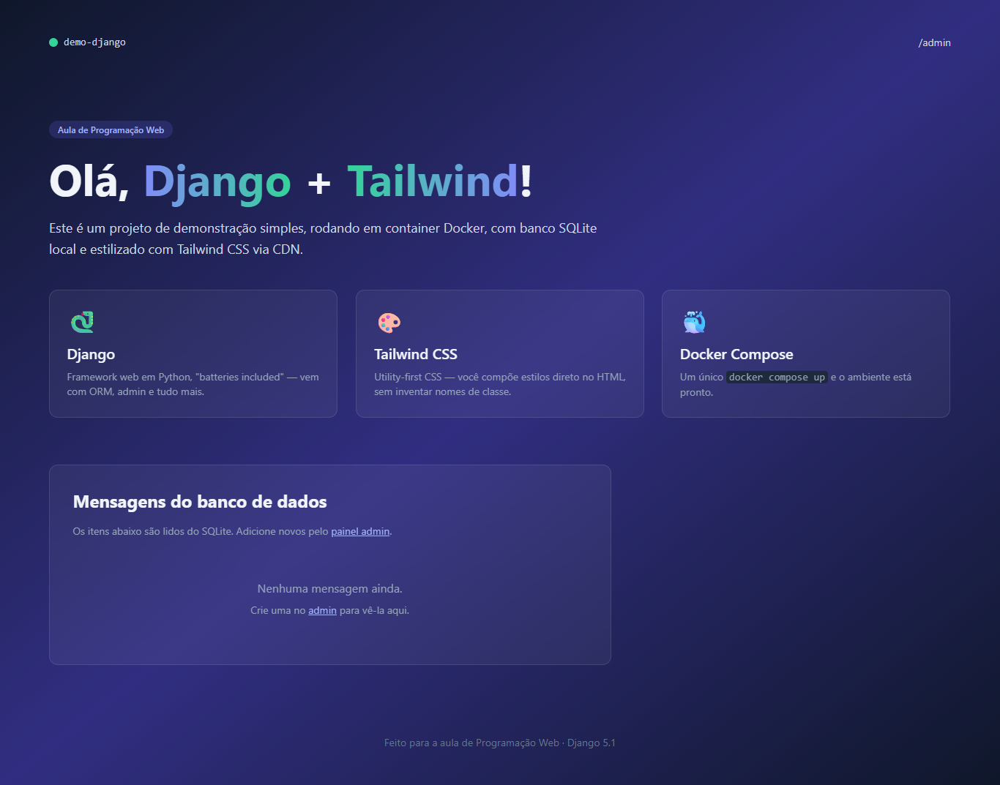
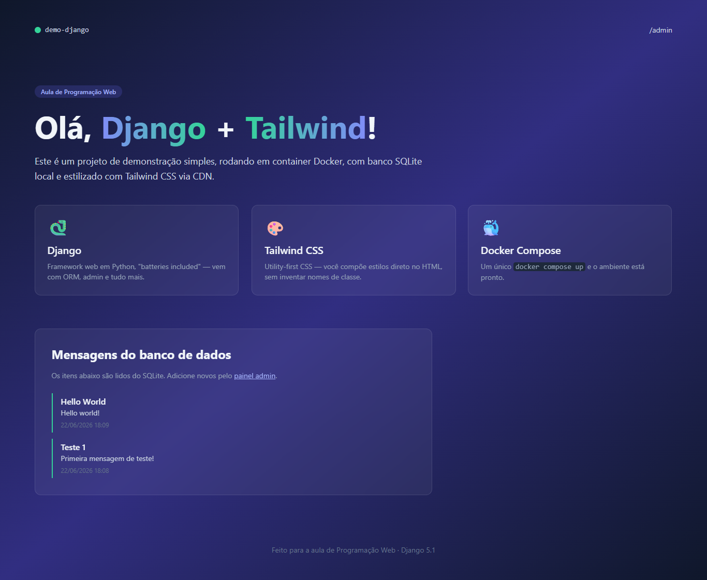
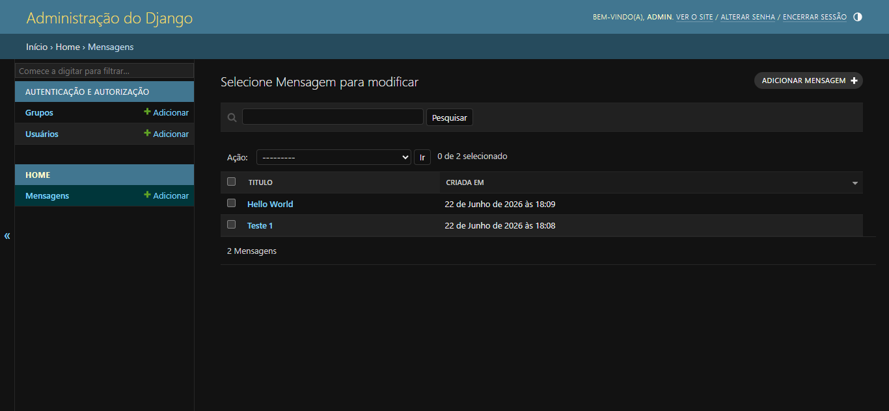

# 🐍 Demo Django — Parte 1: Projeto Inicial

> **Disciplina:** Programação Web  
> **Aluno:** [João Henrique Pedrosa de Souza]  
> **Branch:** [`bcc481-django-parte1`](https://github.com/SEU_USUARIO/SEU_REPOSITORIO/tree/bcc481-django-parte1)

---

## 📋 Descrição

Projeto de demonstração construído como parte do **Roteiro 1** da disciplina de Programação Web. Implementa um site simples de uma página utilizando **Django 5.1**, estilizado com **Tailwind CSS via CDN**, persistindo dados em **SQLite** e executado em container **Docker**.

A página exibe cards com as tecnologias utilizadas e uma seção dinâmica que lista mensagens cadastradas pelo painel administrativo do Django.

---

## 📸 Sistema em execução

### Página principal — sem mensagens cadastradas

> Exibição inicial ao subir o projeto pela primeira vez.

### Página principal — com mensagens cadastradas

> Após cadastrar mensagens pelo painel `/admin/`, elas aparecem listadas na seção "Mensagens do banco de dados".

<!-- Substitua pela sua captura de tela -->

### Painel Admin — listagem de mensagens

> Interface administrativa gerada automaticamente pelo Django, com busca por título e conteúdo.

<!-- Substitua pela sua captura de tela -->

---

## 📚 Conceitos abordados neste roteiro

- Estrutura de projeto Django (`startproject`) e apps (`startapp`)
- Arquivo `Dockerfile` e `docker-compose.yml`
- `settings.py`: `INSTALLED_APPS`, `TEMPLATES`, `LANGUAGE_CODE`, `TIME_ZONE`
- Criação de modelo com `models.Model` e tipos de campo do Django ORM
- Registro no admin com `@admin.register`
- Views baseadas em função (FBV) e passagem de contexto para templates
- Roteamento com `urls.py` no app e inclusão em `core/urls.py`
- Template HTML com Django Template Language e Tailwind CSS
- Migrations: `makemigrations` e `migrate`
